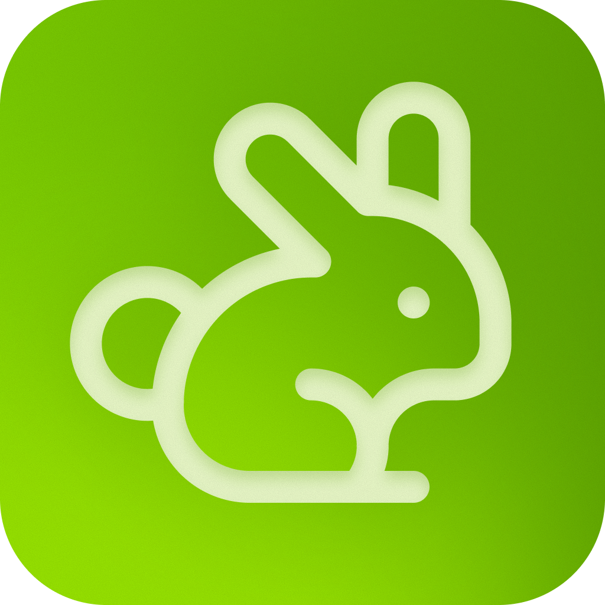

<div align="center">
  

  <div id="toc">
    <ul style="list-style: none">
      <summary>
        <h1>PortalHop</h1>
      </summary>
    </ul>
  </div>

  One player for every IPTV source you've got. Add Stalker (MAG), Xtream Codes, or M3U portals, or skip setup entirely with the built-in free channel catalog from [iptv-org](https://github.com/iptv-org/iptv), and watch everything from one clean UI, with a synced programme guide and favorites, on any device.

  <p>
    
    
    
    
    
    
    
    
  </p>

  **[Try the hosted version →](https://portalhop.vercel.app/)**
</div>

## Features

- **Bring your own portals**: Stalker/MAG (portal URL + MAC), Xtream Codes (server + credentials), or a plain M3U playlist URL. There's also a built in catalog from [iptv-org](https://github.com/iptv-org/iptv) with thousands of free channels and no account required.
- **Programme guide**: pulls EPG from the portal itself, a global XMLTV catalog matched by country, or your own custom XMLTV source, with AI-assisted matching when channel names don't line up cleanly.
- **Favourites**: synced to your account and exportable as a public M3U playlist link, so any IPTV player can pick up your list.
- **A real player**: picture-in-picture, captions, keyboard shortcuts, and live resolution/frame-rate/bitrate info.
- **Optional proxying**: route stream and image requests through a proxy when a portal blocks direct access.

## Run

Copy `.env.example` to `.env`, set `DATABASE_URL`, then start the app:

```bash
npm install
npm run dev
```

Open [http://localhost:3000](http://localhost:3000).

`DATABASE_URL` is the only required variable. Everything else in `.env.example` is optional and gates a specific feature: Google sign-in, encrypting saved portal credentials at rest, AI-assisted channel matching, stream/image proxying, and Mux player analytics.

## Checks

```bash
npm run lint
npm run build
```
